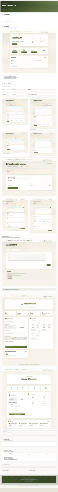

# DataNautX

**AI-powered social intelligence platform.** Turn raw social data into strategic decisions, narratives, and client-ready reports in minutes.

**Extraction** · **Analysis** · **Reports** · **AI Assistant**

---

## 01 The problem

Teams need insight faster than manual workflows can deliver.

- Social data is scattered across platforms and tools  
- Manual tracking is slow and expensive  
- Reports take hours or days to prepare  
- Teams react late because insights arrive too late  

---

## 02 The solution

One end-to-end workflow for collection, analysis, and reporting.

**DataNautX** automates the path from raw social signals to presentation-ready outputs.

**Unified dashboard** — extraction, analysis, reporting, and AI in one place.

- From data extraction to insight generation in one platform  
- AI-powered interpretation instead of manual spreadsheet analysis  
- Professional PDF outputs ready for leadership and clients  

---

## 03 Core capabilities

Automated extraction, AI intelligence, and instant report generation.

### Automated data extraction

Track profiles, posts, company pages, and keywords across platforms with structured outputs.

| Type | Input | Business value |
|------|--------|----------------|
| **Profile links** | Handles / URLs | Track competitors, influencers, spokesperson behavior |
| **Post links** | Post URLs | Audit campaign creatives and post-level performance |
| **Company pages** | Page selection | Benchmark owned pages against competitors |
| **Keywords** | Keyword list + date range | Detect narratives, shifts, and sentiment at issue level |

- Profile extraction — Google Sheets source.  
- Profile extraction — Manual grid.  
- Post extraction — Google Sheets source.  
- Post extraction — Manual grid.  
- Company pages — owned and competitor tracking.  
- Keyword extraction — Google Sheets source.  
- Keyword extraction — Manual source.  

### AI-powered intelligence

Move beyond dashboards. Ask strategic questions and get narrative-level insights.

**AI Assistant** — strategy-ready answers from project context.

> *“List top 3 negative narratives this week and suggest response angles.”*

### Instant report generation

Stakeholder-ready PDF reports with structured cross-platform summaries.

- **Report Studio** — rapid generation and export.  
- **Keyword analysis** — narrative and sentiment view.  

---

## 04 Who it’s for

Built for teams that need speed and clarity.

- **Agencies:** deliver more client reports with less analyst effort  
- **Brands:** monitor campaigns and competitors in near real-time  
- **Public affairs / political:** track narrative shifts and sentiment risk early  

---

## 05 Business impact

Measurable outcomes from automation and AI.

- **80%+** — faster reporting  
- **One** unified workflow  
- **AI** — strategic insights  

Outcomes:

- Replace fragmented manual workflows  
- Improve decision speed and response quality  
- Scale intelligence output without scaling headcount at the same rate  

**DataNautX** — AI-powered social intelligence for faster decisions, stronger reporting, and scalable impact.

---

## 06 Before vs after

| Without DataNautX | With DataNautX |
|-------------------|----------------|
| Manual tracking across multiple tools | Automated collection in one workflow |
| Hours or days to build reports | Minutes to report-ready outputs |
| Scattered data and delayed insight | Unified dashboard and faster decisions |

---

## Start with DataNautX

**Demo** → **Onboarding** → **First insights**

Book a demo · Start your first project · Generate insights in minutes.

---

> **Note:** This is a **public showcase** repository. The source code is maintained in a private repository. For access, collaboration, or demo requests, please reach out via GitHub.

---

## License

This showcase is licensed under the **MIT License** — see [LICENSE](LICENSE).

© 2025 Varahe Analytics Pvt Ltd
