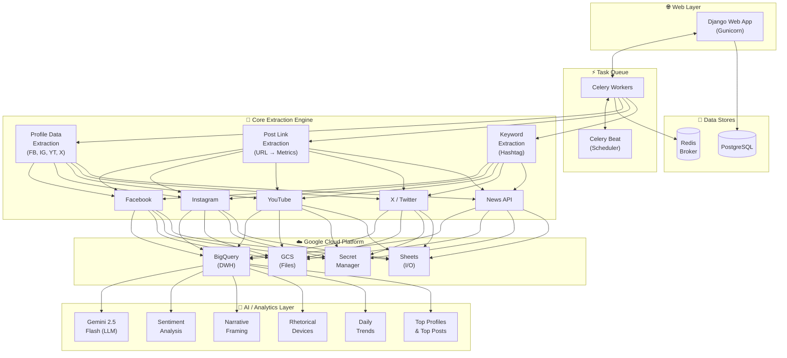

  
  
  
  
  
  
  
  

<h1 align="center">🚀 DataNautX</h1>

  <strong>Enterprise-grade Social Media Intelligence Platform</strong> 
  Extract · Analyze · Report — across Facebook, Instagram, YouTube & X (Twitter)

  <a href="#-screenshots">Screenshots</a> •
  <a href="#-key-features">Features</a> •
  <a href="#-architecture">Architecture</a> •
  <a href="#-tech-stack">Tech Stack</a> •
  <a href="#-license">License</a>

---

> ⚠️ **Note:** This is the **public showcase** repository. The source code is maintained in a private repository. For access or collaboration inquiries, please reach out via [GitHub](https://github.com/shanskarBansal).

---

## 📌 Overview

**DataNautX** is a full-stack data extraction & analytics platform that empowers non-technical users to collect, analyze, and generate reports from major social media platforms—all from a beautiful, modern web dashboard. Built with Django, backed by BigQuery, and deployed on Railway, it combines the power of LLM-driven insights with robust data engineering.

> **Built by** [Varahe Analytics](https://varahe.in) — communications engineering meets data science.

---

## 📸 Screenshots

### 🏠 Dashboard Home
> Project management with real-time activity feed, extraction stats, AI queries count, and quick actions

  

### ⚡ Extraction Workspace — Profile Data & Post Link Extraction
> Dual-mode extraction: **Profile Data Extraction** (Google Sheet / Manual grid) and **Post Link Extraction** with Handsontable spreadsheet editor, platform toggles (FB, IG, YT, X), date range selection, and real-time progress logs

  

### 🔍 Keyword Extraction
> Hashtag-based extraction across all platforms — choose Google Sheet or manual hashtag entry, set per-platform post limits (10/25/50/100), configure date ranges, and enable LLM analysis in one click. Re-run analysis on previous extractions without re-extracting data.

  

### 📊 Keyword Analysis Report
> Deep-dive analytics with sentiment analysis, narrative framing, rhetorical device detection, daily trends, top profiles, and top posts — all generated via Gemini 2.5 Flash LLM + statistical analysis pipeline. Exportable as interactive HTML report or PDF.

  

### 📈 Summary Studio
> Aggregate platform data for specific date ranges, generate summary tabs with engagement buckets (0k-1k through 100M+), and export directly to Google Sheets

  

### 📄 Report Generator
> Professional PDF reports with performance matrices, platform summaries, top posts with thumbnails, and executive notes — from CSV runs or Google Sheets data

  

### 🤖 AI Assistant
> Natural language queries powered by Gemini 2.5 Flash — ask questions about your data in plain English, auto-generates BigQuery SQL, renders charts, and compares creators across platforms

  

---

## ✨ Key Features

### 🔄 Profile Data Extraction
| Platform | Capabilities |
|----------|-------------|
| **Facebook** | Posts, reels, video content, engagement metrics, follower data |
| **Instagram** | Posts, reels, stories metrics, engagement & reach analytics |
| **YouTube** | Videos, shorts, channel stats, views/likes/comments/subscribers |
| **X (Twitter)** | Tweets, engagement, impressions, follower counts |

- Dual data sources: **Google Sheets** input or **manual spreadsheet entry** (Handsontable grid)
- Real-time progress monitoring with live extraction logs
- Concurrent multi-platform extraction via thread pools
- Automatic BigQuery synchronization & GCS file storage
- Reel/video-specific enrichment pipeline (FB Reels, IG Reels)

### 🔗 Post Link Extraction *(NEW)*
- **Direct URL enrichment** — paste any post link (FB, IG, YT, X) to extract full metrics
- Auto-detects platform from URL pattern
- Enriches with: Likes, Shares, Comments, Engagement, Total Reach, Post Date, Caption, Page Name, Followers
- Google Sheet or manual grid input with Handsontable editor
- Concurrent per-platform processing via ThreadPoolExecutor
- Output to Google Sheets + XLSX download

### 🔍 Keyword Extraction & Analysis *(NEW)*
- **Hashtag-based search** across Facebook, Instagram, YouTube & X simultaneously
- **Per-platform post limits** — configure 10, 25, 50, or 100 posts per platform per hashtag
- **Multi-hashtag support** — extract for multiple hashtags in parallel
- Google Sheet or manual hashtag grid input
- **LLM Analysis** (Gemini 2.5 Flash):
  - Sentiment classification (positive / negative / neutral) with confidence scores
  - Narrative framing detection (top 9 narrative frames + "Others")
  - Rhetorical device identification
  - Narrative strength scoring per topic
- **Data Analytics Pipeline**:
  - Topic overview (overall + per-platform)
  - Hashtag usage patterns (by platform & topic)
  - Risk factor indexing (topic × sentiment)
  - Sentiment distribution visualization
  - Daily engagement trends
  - Top profiles (overall + per-platform)
  - Top posts (by topic × sentiment × platform)
- **Re-run analysis** on previous extraction runs without re-extracting data
- **XLSX export** — download complete analysis workbook with all analytics sheets
- **Interactive HTML report** — keyword analysis rendered as a full-page interactive report

### 🤖 AI-Powered Assistant (Gemini 2.5 Flash)
- **Natural language queries** — ask questions in plain English about your extracted data
- **Intelligent SQL generation** — auto-generates & executes BigQuery queries
- **Smart understanding** — handles 200+ keywords and phrases for comprehensive question recognition
- **Visual charts** — request bar, pie, or line charts on-the-fly
- **Cross-platform comparisons** — compare creators, channels, accounts across platforms

### 📈 Reporting Suite
- **Automated PDF generation** with performance matrices, top posts, and executive summaries
- **Google Sheets integration** — read input, write output, and generate reports directly
- **CSV-based reports** from extraction runs
- **Report history** — access all previously generated reports with clean filenames

### 📊 Summary Studio
- **Aggregated summaries** — platform-wise summary reports with engagement buckets
- **Date range filtering** — analyze data for specific time periods
- **View count bucketing** — 16 granular buckets from 0k-1k to 100M+
- **Google Sheets output** — export summaries directly

### 🎨 Modern Web Dashboard
- **Glassmorphic design** — beautiful, modern UI with glassmorphism effects and holo-cards
- **Dark theme** with gradient accents and radial glow effects
- **Responsive design** — works seamlessly on desktop & mobile
- **Smooth animations** — letter-drop effects, count-up animations, GSAP transitions, tilt effects
- **Handsontable grid** — spreadsheet-like manual data entry with context menus
- **Real-time updates** — live extraction progress & status monitoring

### 🏢 Enterprise Features
- **Multi-project workspace** — isolated data, reports, and AI context per project
- **Google OAuth** — secure login with domain-restricted access
- **Celery + Redis** — distributed task queue for background processing
- **Ticket management** — internal issue tracking and collaboration
- **Scheduled extractions** — cron-based automated data collection (via django-celery-beat)
- **Worker health monitoring** — real-time Celery worker status dashboard
- **Google Drive integration** — auto-create Drive sheets for extraction runs
- **Activity history** — full timeline of extractions, AI queries, and reports

---

## 🏗 Architecture

---

## 🛠 Tech Stack

| Layer | Technologies |
|-------|-------------|
| **Frontend** | Django Templates, HTML5, CSS3 (Glassmorphism), JavaScript, GSAP, Three.js |
| **Backend** | Python 3.10+, Django 5.2, Gunicorn |
| **Spreadsheet UI** | Handsontable (Excel-like grid editor in browser) |
| **Task Queue** | Celery 5.x, Redis, django-celery-beat |
| **Database** | PostgreSQL (prod), SQLite (dev) |
| **Data Warehouse** | Google BigQuery |
| **Cloud Storage** | Google Cloud Storage (GCS) |
| **Secrets** | Google Secret Manager |
| **AI/ML** | Google Gemini 2.5 Flash, Pandas, NumPy |
| **PDF Generation** | Playwright (headless browser rendering) |
| **Scraping** | BrightData, Apify, Supermetrics, BeautifulSoup4 |
| **Deployment** | Railway (Procfile-based), Gunicorn |
| **Auth** | Google OAuth 2.0, Django Auth |

---

## 📊 BigQuery Schema

When BigQuery is enabled, extracted data is automatically pushed:

| Column | Type | Description |
|--------|------|-------------|
| `platform` | STRING | `fb`, `ig`, `yt`, or `x` |
| `run_timestamp` | STRING | Extraction timestamp (IST) |
| `post_id` | STRING | Unique post/video identifier |
| `post_url` | STRING | Direct link to the content |
| `created_datetime` | TIMESTAMP | Post creation time (UTC) |
| `content_type` | STRING | video, photo, reel, etc. |
| `caption_or_title` | STRING | Post caption or video title |
| `views` | INT64 | View count |
| `likes` | INT64 | Like/reaction count |
| `comments` | INT64 | Comment count |
| `shares` | INT64 | Share/retweet count |
| `followers` | INT64 | Follower count at extraction |
| `engagement` | INT64 | likes + comments + shares |
| `name` | STRING | Display name / Page name |
| `username` | STRING | Platform username/handle |
| `project_id` | STRING | Project identifier |

---

## 🔒 Security

- **Credentials** — All API keys & secrets stored in Google Secret Manager (never in code)
- **Authentication** — Google OAuth 2.0 with domain-restricted access
- **Environment** — Sensitive config via shell exports; `.gitignore` blocks all secret files
- **Database** — PostgreSQL with connection pooling in production
- **HTTPS** — SSL enforced in production deployments

---

> 🔒 **Source code is private.** For access, collaboration, or demo requests, please contact the maintainer via [GitHub](https://github.com/shanskarBansal).

---

## 📜 License

This project is licensed under the **MIT License** — see the [LICENSE](LICENSE) file for details.

© 2025 Varahe Analytics Pvt Ltd

---

  Built with ❤️ by <a href="https://varahe.in">Varahe Analytics</a> — Communications Engineering meets Data Science

