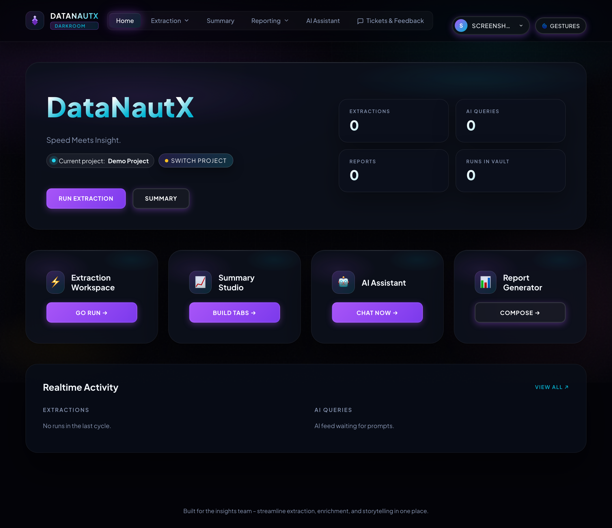
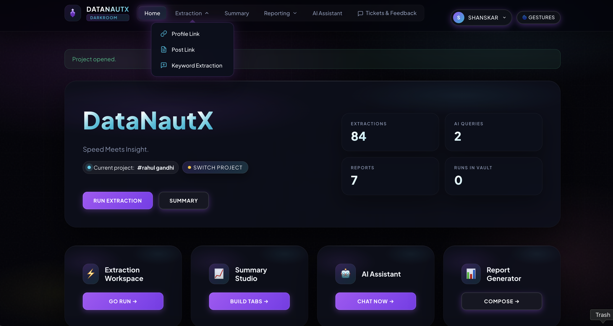
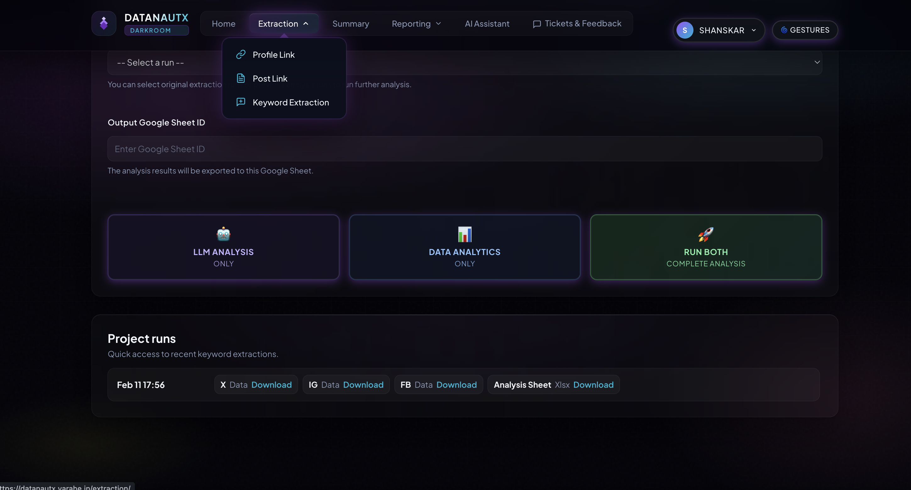
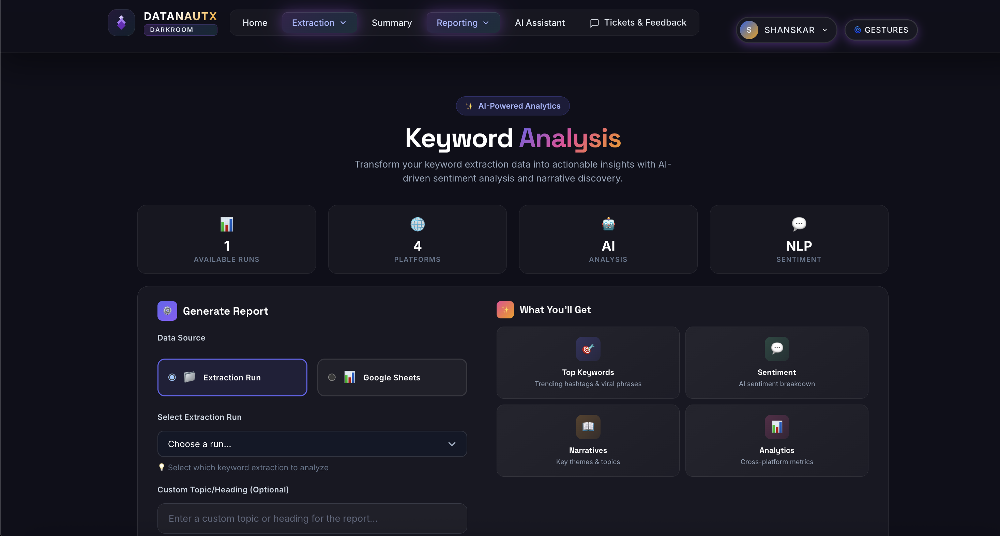
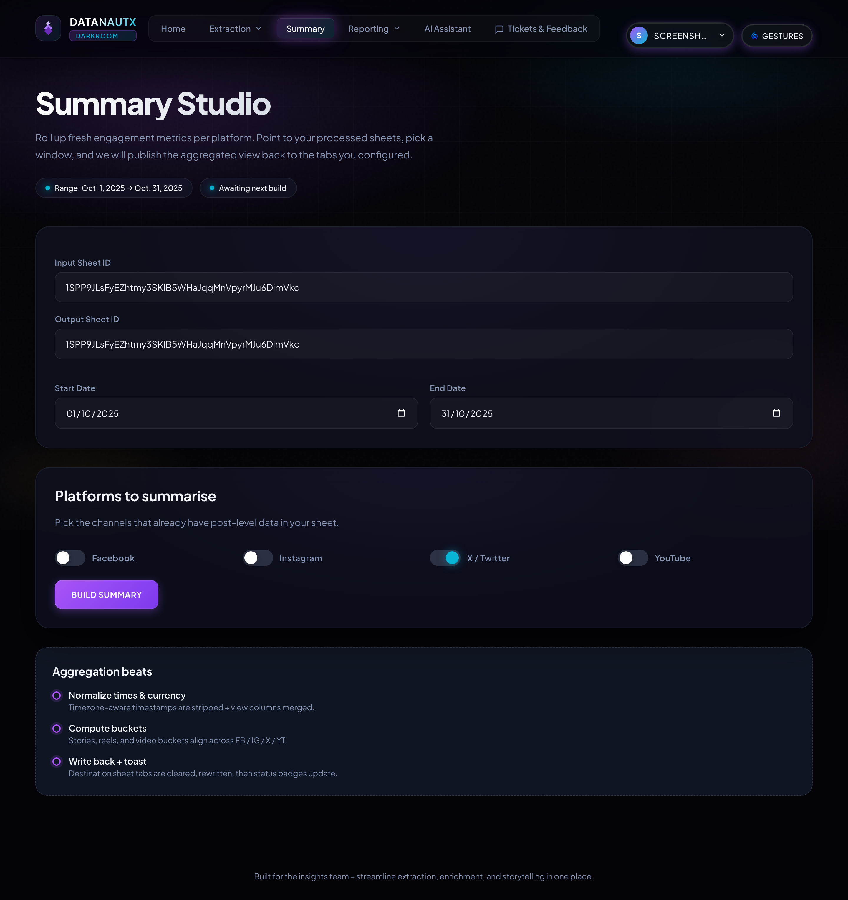
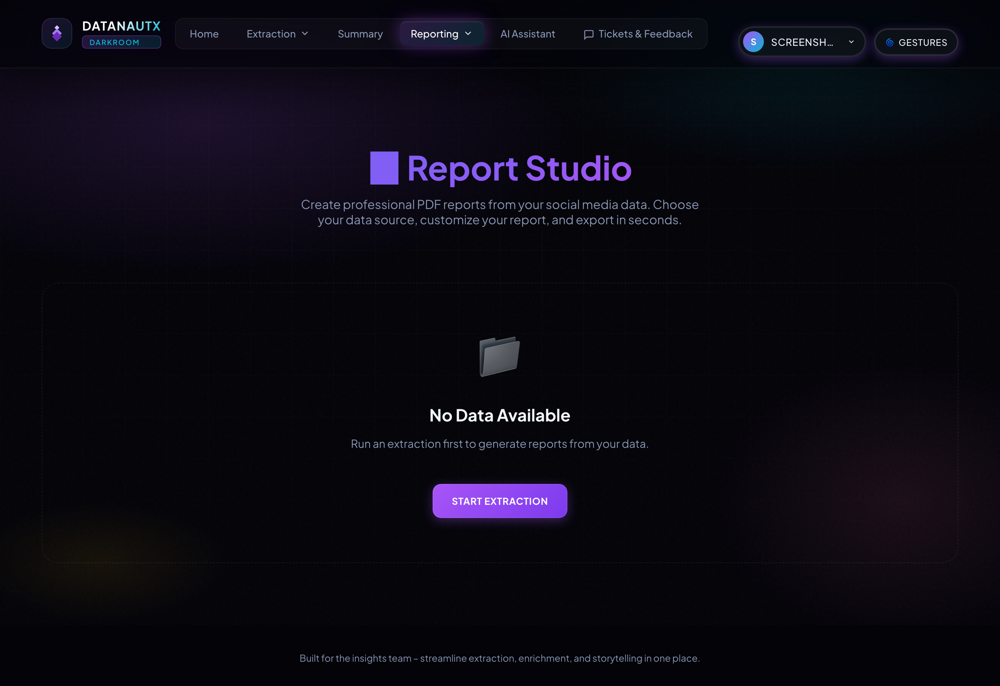
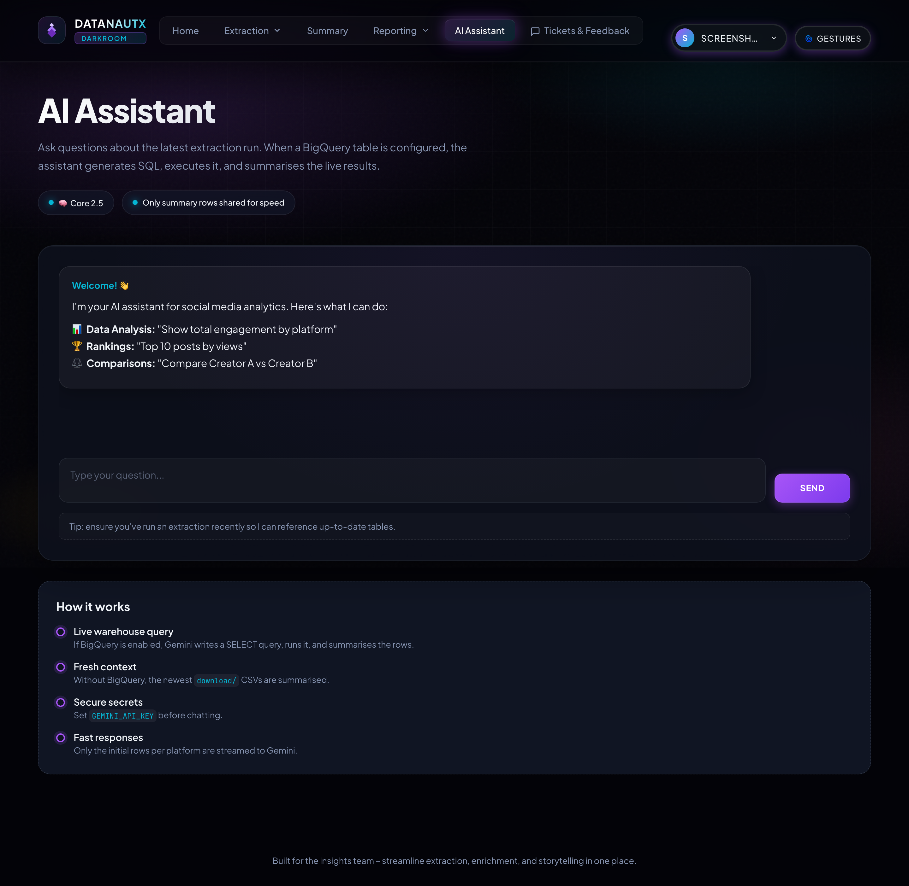
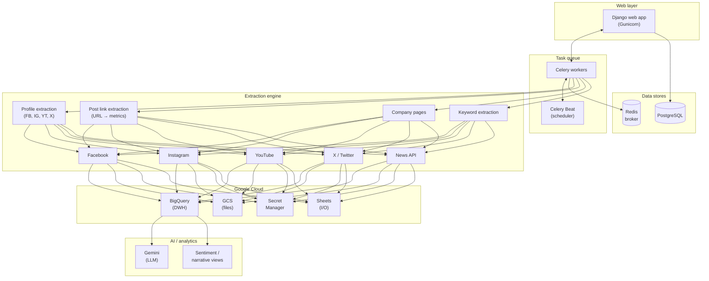

# DataNautX

**AI-powered social intelligence** — turn raw social data into strategic decisions, narratives, and client-ready reports in minutes.

Extract · Analyze · Reports · AI Assistant

[Screenshots](#-screenshots) · [Features](#-key-features) · [Architecture](#-architecture) · [Tech Stack](#-tech-stack) · [License](#-license)

---

> **Note:** This is the **public showcase** repository. The source code is maintained in a private repository. For access, collaboration, or demo requests, please reach out via GitHub.

---

## Overview

**DataNautX** is an end-to-end platform for **collection, analysis, and reporting**: one unified dashboard for extraction, narrative-level AI intelligence, and stakeholder-ready outputs. It is built for teams that need **speed and clarity** without fragmented tools.

> **Built by** Varahe Analytics — communications engineering meets data science.

---

## The challenge

- Social data is scattered across platforms and tools  
- Manual tracking is slow and expensive  
- Reports take hours or days to prepare  
- Teams react late because insight arrives too late  

---

## The solution

**One unified workflow** from raw social signals to presentation-ready outputs.

- **Automated collection** in a single product instead of many tools  
- **AI-powered interpretation** instead of only manual spreadsheet analysis  
- **Professional PDF outputs** for leadership and clients  

---

## Core capabilities

### Automated data extraction

Track **profiles, posts, company pages, and keywords** across major platforms with structured outputs (Google Sheets and/or manual grid entry where applicable).

| Type | Input | Business value |
|------|--------|----------------|
| **Profile links** | Handles / URLs | Track competitors, influencers, spokesperson behavior |
| **Post links** | Post URLs | Audit campaign creatives and post-level performance |
| **Company pages** | Page selection | Benchmark owned pages against competitors |
| **Keywords** | Keyword list + date range | Detect narratives, shifts, and sentiment at issue level |

- Profile extraction — Google Sheets or manual grid  
- Post link extraction — Google Sheets or manual grid  
- Company pages — owned and competitor tracking  
- Keyword extraction — Google Sheets or manual source  

### AI-powered intelligence

Move beyond static dashboards: ask strategic questions and get **narrative-level insights** from project context (natural language → BigQuery, charts, comparisons).

Example prompt: *“List the top 3 negative narratives this week and suggest response angles.”*

### Instant report generation

Stakeholder-ready **PDF reports** with structured cross-platform summaries.

- **Report Studio** — rapid generation and export  
- **Keyword analysis** — narrative and sentiment-oriented view (including interactive HTML export where enabled)  

---

## Who it’s for

| Audience | Outcome |
|----------|---------|
| **Agencies** | Deliver more client reports with less analyst effort |
| **Brands** | Monitor campaigns and competitors in near real-time |
| **Public affairs / political** | Track narrative shifts and sentiment risk early |

---

## Business impact

| Without DataNautX | With DataNautX |
|-------------------|----------------|
| Manual tracking across multiple tools | **One** automated collection workflow |
| Hours or days to build reports | **Minutes** to report-ready outputs |
| Scattered data and delayed insight | Unified dashboard and faster decisions |

**Highlights** — replace fragmented manual workflows, improve decision speed and response quality, and scale intelligence output without scaling headcount at the same rate.

---

## Screenshots

### Dashboard home

> Project management with real-time activity feed, extraction stats, AI queries count, and quick actions

### Extraction workspace — profile data & post link extraction

> Dual-mode extraction: **profile data** (Google Sheet / manual grid) and **post link extraction** with Handsontable spreadsheet editor, platform toggles (FB, IG, YT, X), date range selection, and real-time progress logs

### Keyword extraction

> Hashtag-based extraction across platforms — Google Sheet or manual hashtag entry, per-platform post limits, date ranges, and optional LLM analysis in one flow. Re-run analysis on previous runs without re-extracting.

### Keyword analysis report

> Deep-dive analytics with sentiment, narrative framing, rhetorical signals, daily trends, top profiles, and top posts — exportable as interactive HTML and PDF where configured

### Summary studio

> Aggregate platform data for date ranges, summary tabs with engagement buckets, export to Google Sheets

### Report studio

> Professional PDF reports with performance views, platform summaries, top posts with thumbnails, and executive notes — from CSV runs or Google Sheets

### AI assistant

> Natural language queries powered by Gemini — ask questions in plain English, auto-generate BigQuery SQL, render charts, compare creators across platforms

---

## Key features

### Profile data extraction

| Platform | Capabilities |
|----------|----------------|
| **Facebook** | Posts, reels, video content, engagement metrics, follower data |
| **Instagram** | Posts, reels, stories metrics, engagement & reach analytics |
| **YouTube** | Videos, shorts, channel stats, views/likes/comments/subscribers |
| **X (Twitter)** | Tweets, engagement, impressions, follower counts |

- Dual inputs: **Google Sheets** or **manual grid** (Handsontable)  
- Live extraction logs; concurrent multi-platform extraction  
- BigQuery synchronization and GCS storage where configured  
- Reel/video-oriented enrichment (e.g. FB Reels, IG Reels)  

### Post link extraction

- **URL → metrics** for FB, IG, YT, X  
- Enrichment: likes, shares, comments, engagement, reach, dates, captions, page names, followers  
- Sheet or manual grid; concurrent per-platform processing  
- Output to Google Sheets and XLSX download  

### Company pages

- **Owned and competitor** page selection for benchmarking and monitoring  

### Keyword extraction & analysis

- **Hashtag / keyword search** across platforms  
- **Per-platform post limits** (e.g. 10 / 25 / 50 / 100) and multi-hashtag support  
- Optional **LLM analysis** (Gemini): sentiment, narrative framing, rhetorical signals, narrative strength  
- Analytics: topic overviews, hashtag patterns, risk-style indexing, sentiment views, daily trends, top profiles and posts  
- Re-run analysis on prior extractions; **XLSX** and **interactive HTML** exports where enabled  

### AI assistant (Gemini)

- Natural language questions about project data  
- Intelligent SQL generation for BigQuery  
- Broad intent coverage; bar, pie, and line charts  
- Cross-platform comparisons  

### Reporting suite

- **Report Studio** — automated PDFs, performance matrices, top posts, executive summaries  
- Google Sheets and **CSV** inputs; **report history** with clean filenames  

### Summary studio

- Platform-wise summaries with engagement buckets (e.g. 0k–1k through 100M+)  
- Date-range filtering; Google Sheets export  

### Modern web dashboard

Glassmorphic UI, dark theme, responsive layout, GSAP-style motion, real-time extraction status  

### Enterprise-oriented features

Multi-project workspaces, Google OAuth (domain restrictions where configured), **Celery + Redis**, ticketing, scheduled extractions, worker visibility, Google Drive hooks for sheets, full activity history  

---

## Architecture

---

## Tech stack

| Layer | Technologies |
|-------|----------------|
| **Frontend** | Django templates, HTML/CSS, JavaScript, GSAP, Three.js |
| **Backend** | Python 3.10+, Django 5.2, Gunicorn |
| **Spreadsheet UI** | Handsontable |
| **Task queue** | Celery 5.x, Redis, django-celery-beat |
| **Database** | PostgreSQL (prod), SQLite (dev) |
| **Data warehouse** | Google BigQuery |
| **Object storage** | Google Cloud Storage |
| **Secrets** | Google Secret Manager |
| **AI / analytics** | Google Gemini, Pandas, NumPy |
| **PDF** | Playwright (headless rendering) |
| **Scraping / data** | Bright Data, Apify, Supermetrics, BeautifulSoup4 |
| **Deployment** | Railway (Procfile), Gunicorn |
| **Auth** | Google OAuth 2.0, Django auth |

---

## BigQuery schema (when enabled)

| Column | Type | Description |
|--------|------|-------------|
| platform | STRING | fb, ig, yt, or x |
| run_timestamp | STRING | Extraction timestamp (e.g. IST) |
| post_id | STRING | Unique post/video id |
| post_url | STRING | Direct link |
| created_datetime | TIMESTAMP | Post time (UTC) |
| content_type | STRING | video, photo, reel, etc. |
| caption_or_title | STRING | Caption or title |
| views | INT64 | View count |
| likes | INT64 | Likes/reactions |
| comments | INT64 | Comments |
| shares | INT64 | Shares/retweets |
| followers | INT64 | Followers at extraction |
| engagement | INT64 | likes + comments + shares |
| name | STRING | Display / page name |
| username | STRING | Handle |
| project_id | STRING | Project identifier |

---

## Security

- **Credentials** — API keys and secrets in Secret Manager (not in code)  
- **Authentication** — Google OAuth 2.0; domain restrictions where configured  
- **Configuration** — sensitive values via environment / exports; secret files gitignored  
- **Database** — PostgreSQL with pooling in production  
- **HTTPS** — enforced in production  

---

> **Source code is private.** For access, collaboration, or demos, contact the maintainer via GitHub.

---

## License

This showcase materials are licensed under the **MIT License** — see [LICENSE](LICENSE).

© 2025 Varahe Analytics Pvt Ltd

---

Built with care by **Varahe Analytics** — communications engineering meets data science.
